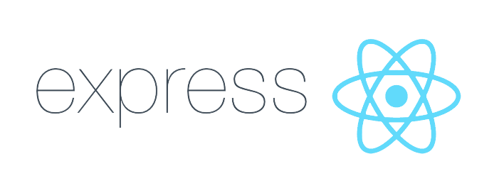

# Javascript

Modulo 1: Iniciante - Concluido  
Modulo 2: Logica de Programação - Concluido  
Modulo 3: Funções Avançado - Concluido  
Modulo 4: Arrays Avançado - Concluido  
Modulo 5: Objetos Avançado - Concluido  
Modulo 6: Classes - Concluido  
Modulo 7: Javascript assincrono - Concluido  
Modulo 8: Tooling e ES6 - Concluido  
Modulo 9: Node JS - Concluido  
Modulo 10: React - Em andamento  

*Pratica: 
1. Relogio Basico 
2. Mir4 Calculadora 
3. Arrays Eleição 2022. 

**Projetos Futuros**

1. Cronometro
2. Calculadora
3. Quiz / Perguntas e Respostas
4. App de Tempo com APi / muda o plano de fundo conforme o tempo
5. AI Image Recognition

### Node.js

### API Rest, CRUD, Controles

### React e Redux

### TypeScript

## Extra

### MySQL

### Next.js

 
